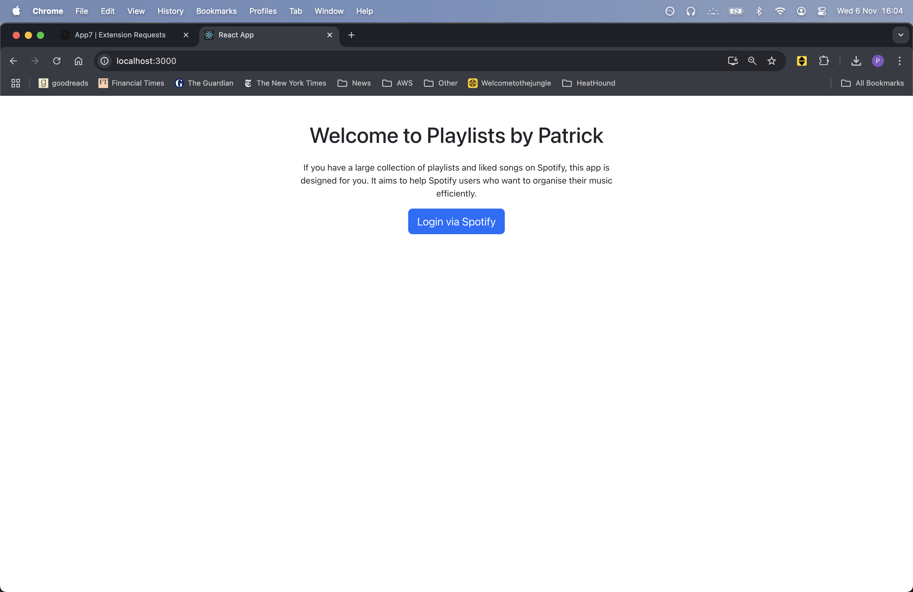

# Welcome to my Spotify App: Playlists by Patrick

### About this Repository

This repository houses the front-end code for my app. It was built using React, and is currently 
deployed on AWS via AWS Amplify. In turn, this is connected to the back-end via AWS API Gateway and AWS Lambda. 

Here is the link to my app: https://main.d2me7vq60w2nib.amplifyapp.com/

This app uses the Spotify API and is currently in development mode. To roll this app out publicly, 
I have submitted a Quota Extension Request. For now only registered users can use it's functions.
If you would like to give it a go, please do reach out to me by providing your Spotify account email!

In the meantime, here is an overview of what my app does.

### What This App Does

Using the Spotify API, this app securely accesses your listening data and preferences to create a unique profile and
generate customized playlists with two main features:

1. Curated Playlists: Finds songs that exist in one area of your library but not another, helping you discover overlooked favorites.
2. Personalized Recommendations: Suggests songs that truly reflect your listening habits, saving you from sorting through vast collections.

### Why Personalization Matters

With large music libraries, managing playlists can be overwhelming. For instance, if you have thousands of songs spread 
across different playlists and your Liked Songs, it’s easy to lose track of favorites. Instead of flooding your “liked” 
list with every track, this app prioritises songs by analysing your habits and listening history.

### How the Recommendation Algorithm Works

When you generate a playlist, the app ranks songs based on a composite score derived from five factors:

1. Playlist Frequency: Songs appearing in multiple playlists score higher (for liked songs recommendations only). 
2. Artist Score: Songs by your top artists are prioritized.
3. Tracks Score: Tracks from frequently listened-to artists are prioritized.
4. Recently Added Score: Songs associated with recently added favorites get preference.
5. Date Added to Library: Newer songs score higher than older ones.

Each factor is given a 20% weighting by default, but you can customize these weights on the setup page to tailor 
your recommendations. For example, if you’d like more songs from your top artists, you can increase this factor weighting.

To see this in action, here is an example of how the user can use this app.

