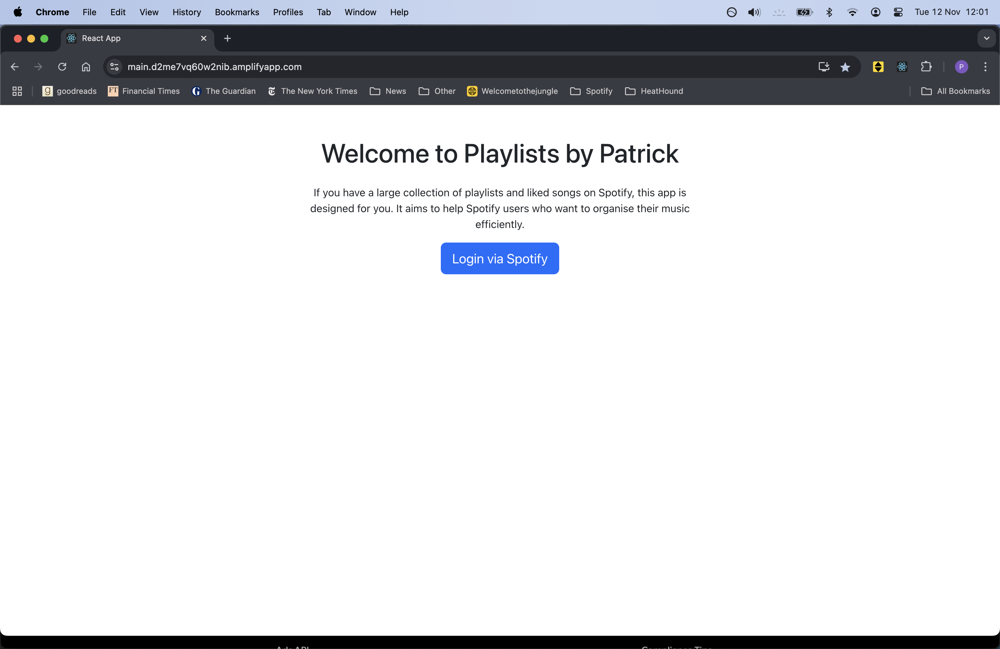
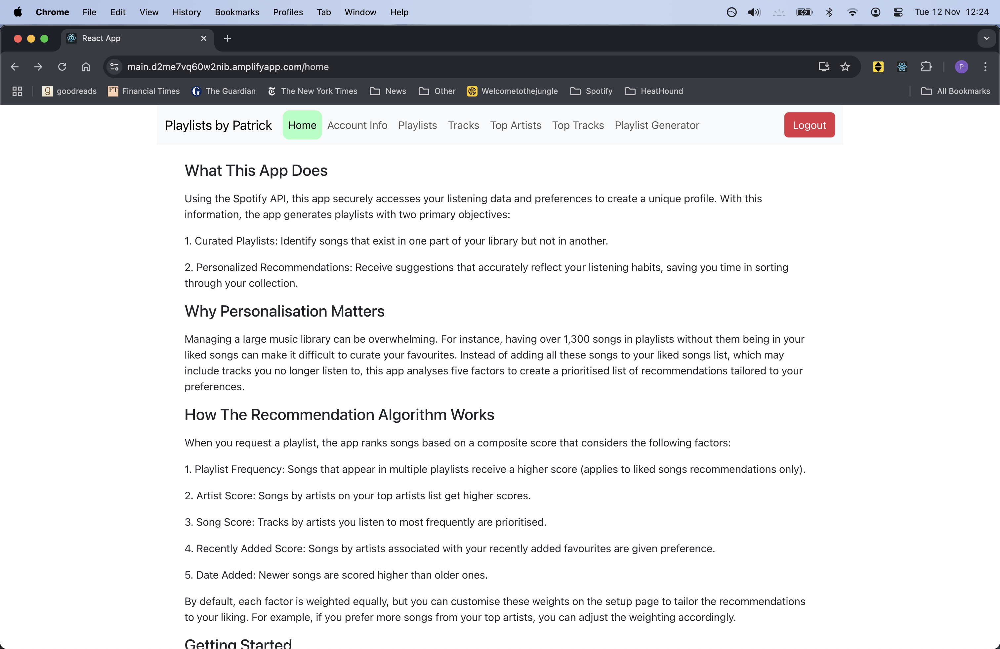
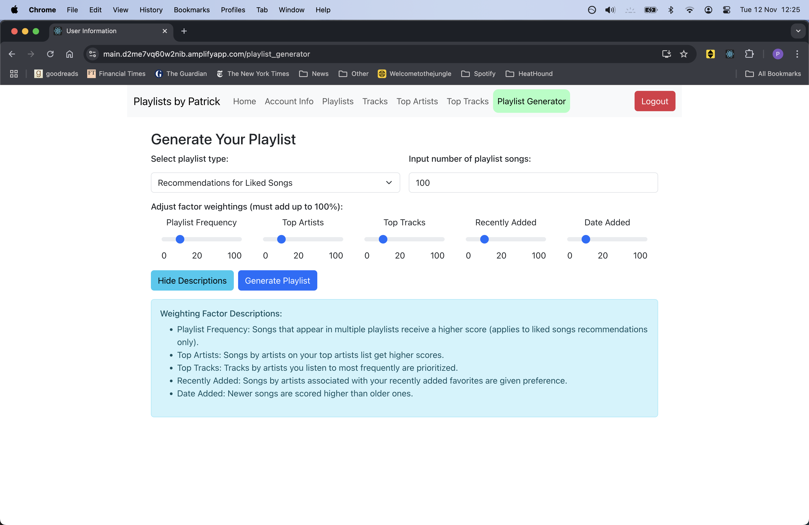
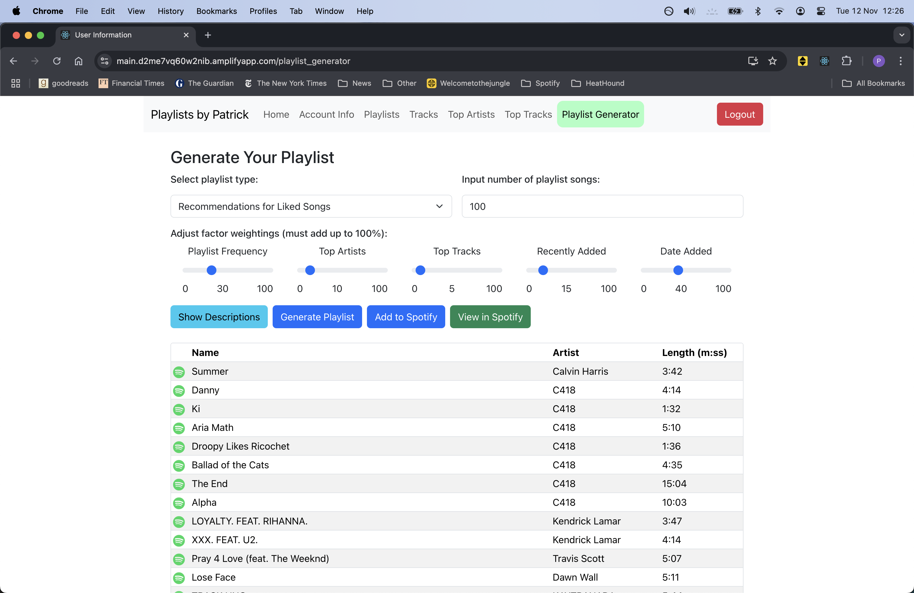
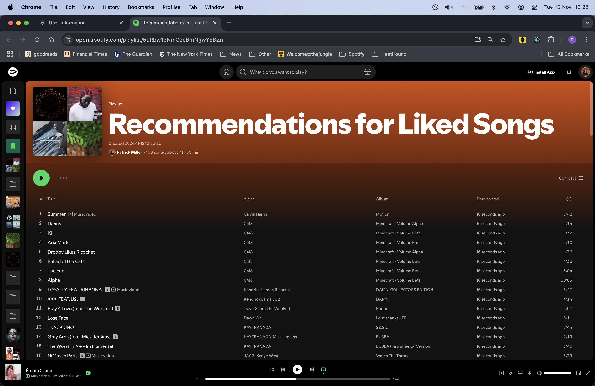
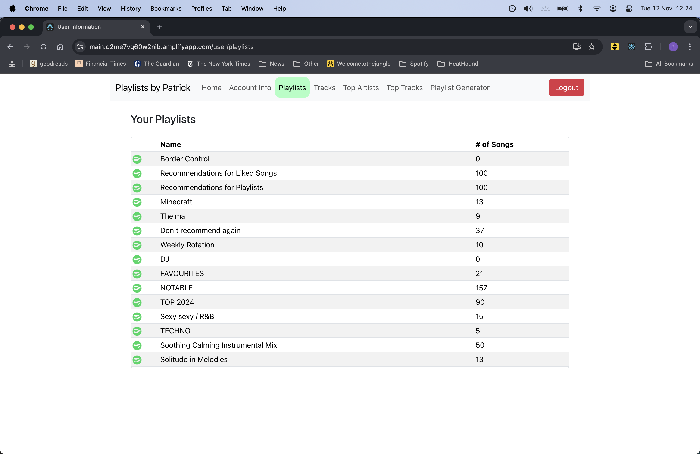
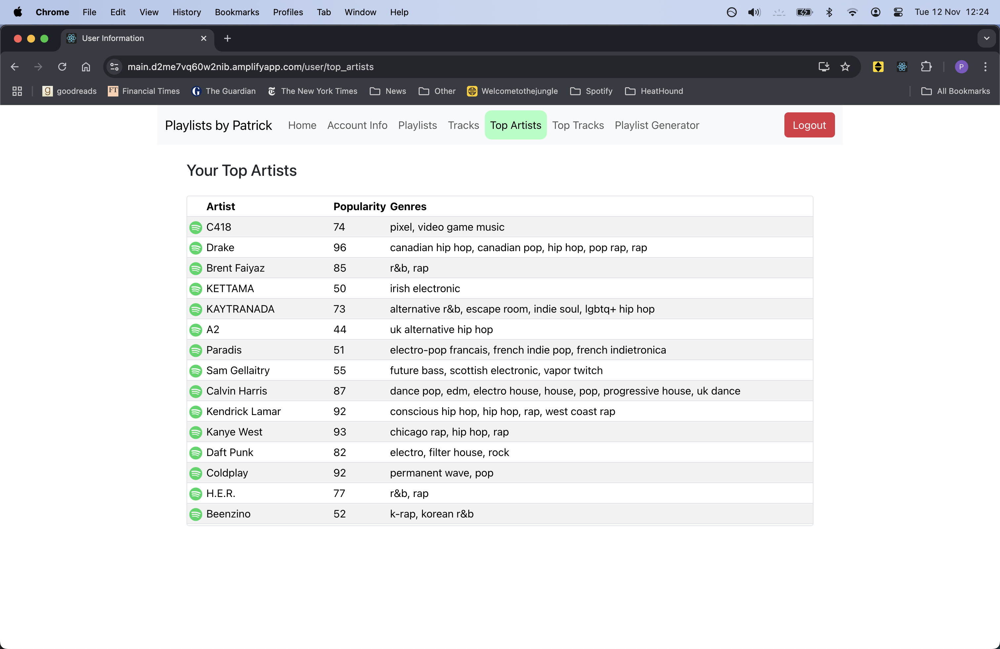

# Welcome to playlistsbypatrick.com

## Table of Contents
- [Background Info](#background-info)
- [What This App Does](#what-this-app-does)
- [Why Personalisation Matters](#why-personalisation-matters)
- [How the Recommendation Algorithm Works](#how-the-recommendation-algorithm-works)
- [User Experience Example With Screenshots](#user-experience-example)
- [Other Features](#other-features)

## Background Info

This repository houses the front-end code for my app. It is built using React, and is currently 
deployed on AWS via AWS Amplify. This is connected to the back-end via AWS API Gateway and AWS Lambda. 
The back-end was written in Python, and then converted into a web framework using FastAPI. 
I use the Supabase Python SDK for database management and Terraform to write the server infrastructure as code.

Here is the link: https://playlistsbypatrick.com

This app uses the Spotify API and is currently in development mode. To roll this app out publicly, 
I have submitted a Quota Extension Request. For now only registered users can use it's functions.
If you would like to give it a go, please do reach out to me! I'll need your name and Spotify account email.

I started developing this app at the beginning of October 2024. The current version is a minimum viable product (MVP) 
and I am currently working on improving the front-end user experience.

## What This App Does

This app securely accesses your listening data and preferences to create a unique profile in order to
generate customised playlists with two main features:

1. Curated Playlists: Finds songs that exist in one area of your library but not another, helping you discover overlooked favourites.
2. Personalised Recommendations: Suggests songs that truly reflect your listening habits, saving you from sorting through vast collections.

## Why Personalisation Matters

With large music libraries, managing playlists can be overwhelming. 
For instance, if you have thousands of songs spread across different playlists and your Liked Songs, 
it’s easy to lose track of favourites.
This app aims to make playlist management easier by using a five-factor algorithm to identify the tracks you're most likely
to want to add your playlists or Liked Songs.

## How the Recommendation Algorithm Works

When you generate a playlist, the app ranks songs based on a composite score derived from five factors:

1. Playlist Frequency: Songs appearing in multiple playlists score higher (for liked songs recommendations only). 
2. Artist Score: Songs by your top artists are prioritised.
3. Tracks Score: Tracks from frequently listened-to artists are prioritised.
4. Recently Added Score: Songs associated with recently added favourites get preference.
5. Date Added to Library: Newer songs score higher than older ones.

Each factor is given a 20% weighting by default, and you can customise these weights on the setup page to tailor 
the recommendations.

## User Experience Example

Here is an example of how the user would use this app to generate a playlist of track recommendations for their Liked Songs.
All recommendations will be tracks that are in a user's playlists but not in a user's Liked Songs.

1. The user enters the URL into their browser to arrive at the landing page.
    

2. Upon pressing _Login via Spotify_, they are redirected to the Spotify login page where they enter their credentials
and authorise the app to access to their library. They are then redirected to the home page where they can read about what this app
does and how it works.
    

3. To generate a playlist, they can click on _Playlist Generator_ in the navigation bar. On this page, the user
can select whether they want a playlist which recommends tracks for either their Liked Songs or their playlists, 
select the number of songs they want in the generated playlist, and select the weightings for each factor.
    

4. After the user presses _Generate Playlist_, the generated playlist is displayed in a table, along with the
option to add this playlist to Spotify. The songs in this playlist are the highest-scoring songs according to the 
factor weighting inputted. If the user wants to try a different weighting, they can toggle the sliders to generate a new playlist. 
Once happy, the user has the option to add the playlist to their spotify account. 
    

5. Once _Add to Spotify_ is pressed, the user can click on _View in Spotify_, which will redirect 
them to their newly created playlist.
    

## Other Features

As seen on the navigation bar, this app also lets users view information about their Spotify library. 

For example, your playlists
    

and your top artists:
    
